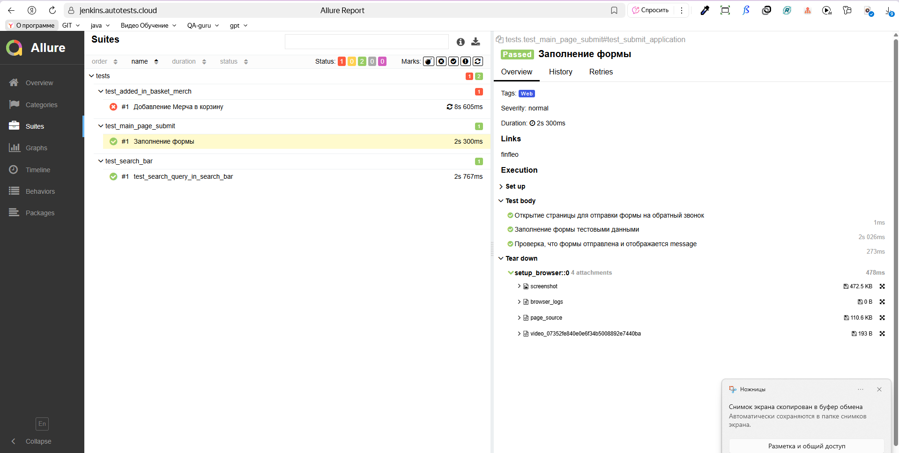
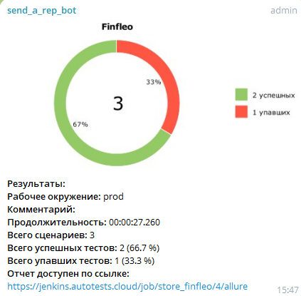

# Автоматизированные UI-тесты для страницы finfleo

## 📌 О проекте

Автоматизированные тесты для веб-интерфейса:
- Добавление Мерча в корзину и заполнение формы, с проврекой что форма заполнена
- Заполнение формы для обратной связи с проверкой, что форма отправлена
- Проверка через поисковую строку спецтехники которой нет в наличии с проверкой 

## 🛠 Технологический стек

<div align="center">
  
   
   
   
   
   
   
   
   
  
  
</div>

  - **Python 3.9+** - язык программирования
  - **Selenium WebDriver** - автоматизация браузера
  - **Selene** - удобная обертка над Selenium
  - **Pytest** - фреймворк для тестирования
  - **Allure** - генератор отчетов
  - **Jenkins** - система непрерывной интеграции
  - **Selenoid** - контейнеризованный запуск браузеров

## 📂 Структура проекта

```
.
├── .venv
├── model
│   ├── data
│   │   └── users.py
├── finfleo_page
│   ├── added_bascet_merge.py
│   ├── main_page_submit.py
│   └── search_bar.py
├── sources
│   ├── icon
│   │   ├── allure_report.png
│   │   ├── allure_testops.png
│   │   ├── pytest.png
│   │   ├── python-original.svg
│   │   ├── selene.png
│   │   ├── selenoid.png
│   │   └── tg.png
├── tests
│   ├── allure_results
│   ├── test_added_in_basket_merch.py
│   ├── test_main_page_submit.py
│   └── test_search_bar.py
├── utils
│   └── attach.py
├── .env
├── .gitignore
├── allure-notifications-4.9.0.jar
├── confest.py
├── pytest.ini
├── README.md
└── requirements.txt
```

## 🌐 CI/CD и Мониторинг


**Ссылка на сборку**:  
[jenkins](https://jenkins.autotests.cloud/job/store_finfleo/)

**Особенности пайплайна**:
- Автоматический запуск тестов в Selenoid
- Генерация Allure-отчёта
- Отправка уведомлений в Telegram


**Пример отчёта**:  
[(https://jenkins.autotests.cloud/job/store_finfleo/4/allure/)](https://jenkins.autotests.cloud/job/store_finfleo/4/allure/)

<div align="center">
  
   
  
</div>

###  Telegram Bot


<div align="center">
  
   
   
   
  
</div>
-------

**Отбика прогонов с уведомлением в ТГ**:  
[Отбивка прогонов автотестов](https://t.me/+2XQAhYNunURkN2Uy)
<div align="center">
  
  
  
</div>
